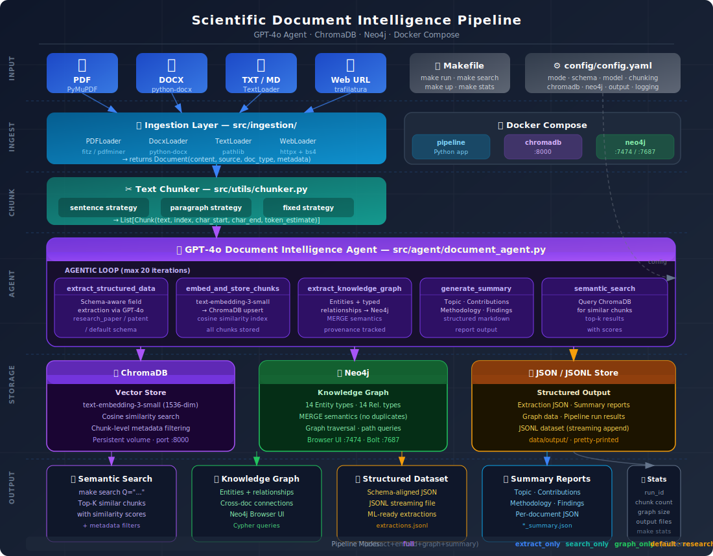

# Scientific Document Intelligence Pipeline

> An AI-agent-powered pipeline that converts unstructured PDFs, patents, and research documents into structured datasets, knowledge graphs, and semantic search indexes — containerized with Docker Compose and controlled entirely through a single `Makefile`.

---

## Architecture Overview



The pipeline has six distinct layers that flow top-to-bottom:

| Layer | Module | Responsibility |
|---|---|---|
| **Input** | `src/ingestion/` | Load documents from PDF, DOCX, TXT/MD, or Web URL |
| **Ingest** | `base_loader.py` → `Document` | Normalize all formats into a standard `Document` object |
| **Chunk** | `src/utils/chunker.py` | Split text into overlapping chunks (3 strategies) |
| **Agent** | `src/agent/document_agent.py` | GPT-4o agentic loop calling tools autonomously |
| **Storage** | `src/storage/` | Persist to ChromaDB, Neo4j, and JSON files |
| **Output** | `data/output/` | Semantic search results, graph queries, reports, datasets |

---

## Quick Start

### Prerequisites

- Docker & Docker Compose
- An [OpenAI API key](https://platform.openai.com/api-keys)
- GNU Make

### Three commands to get running

```bash
# 1. First-time setup — creates .env from template
make setup

# 2. Edit .env and add your API key
#    OPENAI_API_KEY=sk-...

# 3. Build image and start all services
make build && make up

# 4. Drop documents in data/input/ then run the pipeline
make run
```

That's it. Your documents will be extracted, embedded, graph-analyzed, and summarized.

---

## All Makefile Commands

### Setup & Lifecycle

| Command | Description |
|---|---|
| `make setup` | First-time setup — copies `.env.example` → `.env`, creates data dirs |
| `make build` | Build the Docker image (with `--no-cache`) |
| `make build-fast` | Build using Docker layer cache (faster on re-builds) |
| `make up` | Start ChromaDB + Neo4j services in background, wait for health |
| `make down` | Stop and remove all containers |
| `make down-volumes` | Stop + delete all persistent volumes *(destructive)* |
| `make restart` | Restart all services |
| `make ps` | Show container status |

### Running the Pipeline

```bash
# Process all documents in data/input/ (default)
make run

# Process a single file
make run FILE=data/input/paper.pdf

# Process from a web URL
make run URL=https://arxiv.org/abs/1706.03762

# Process a custom directory
make run DIR=/path/to/docs/

# Override pipeline mode
make run MODE=extract_only FILE=data/input/patent.pdf

# Override schema
make run SCHEMA=research_paper FILE=data/input/paper.pdf

# Convenience shortcuts
make run-paper FILE=data/input/attention.pdf     # research_paper schema
make run-patent FILE=data/input/us_patent.pdf    # patent schema
make run-full FILE=data/input/doc.pdf            # all stages
make run-extract FILE=data/input/doc.pdf         # extraction only
make run-search FILE=data/input/doc.pdf          # embedding only
make run-graph FILE=data/input/doc.pdf           # graph only
```

### Search & Inspection

```bash
# Semantic search over all indexed documents
make search Q="attention mechanism transformer"

# Limit results
make search Q="CRISPR gene editing" TOP_K=5

# Filter by metadata
make search Q="machine learning" TOP_K=20

# Pipeline statistics (chunk count, graph size, output files)
make stats

# Neo4j Browser UI
make neo4j-browser   # prints URL: http://localhost:7474

# ChromaDB API
make chromadb-ui     # prints URL: http://localhost:8000
```

### Development

```bash
make shell           # Interactive bash shell in the container
make shell-python    # Python REPL in the container
make test            # Run all pytest tests
make test-local      # Run tests locally (no Docker)
make test-coverage   # Tests + HTML coverage report
make lint            # ruff + mypy
make format          # Auto-format with ruff
make logs            # Tail all service logs
make logs-pipeline   # Pipeline container logs only
```

### Cleanup

```bash
make clear-outputs   # Delete output JSON files only
make clear-all       # Clear ChromaDB + Neo4j + outputs (asks for confirmation)
```

---

## Pipeline Modes

Control exactly which stages run using the `MODE` variable:

| Mode | Stages | Use case |
|---|---|---|
| `full` *(default)* | extract + embed + graph + summarize | Complete pipeline run |
| `extract_only` | structured extraction + summary | Build a dataset, no vector store |
| `search_only` | embedding + ChromaDB indexing | Index a corpus for search |
| `graph_only` | entity/relationship extraction + Neo4j | Knowledge graph construction |

```bash
make run MODE=full FILE=paper.pdf
make run MODE=extract_only DIR=data/papers/
```

---

## Schemas

Three built-in extraction schemas, selectable via `SCHEMA=`:

### `research_paper` — Academic Papers
Extracts 20 structured fields including title, authors, abstract, methodology, datasets, evaluation metrics, key results, contributions, and code availability.

### `patent` — Patents & Patent Applications
Extracts 18 fields including patent number, inventors, assignee, IPC/CPC classifications, independent claims, technical field, prior art, and commercial applications.

### `default` — General Documents
Extracts 13 general-purpose fields: title, document type, authors, date, organization, summary, main topics, key entities, keywords, findings, and recommendations.

Custom schemas can be added by dropping a new `.json` file into `config/schemas/` with the same structure.

---

## Configuration

All settings live in `config/config.yaml`. Every value supports environment variable substitution via `${VAR_NAME}`.

```yaml
pipeline:
  mode: full                    # full | extract_only | search_only | graph_only
  model: gpt-4o                 # OpenAI model
  temperature: 0.1              # 0.0 = deterministic
  schema_type: default          # default | research_paper | patent

chunking:
  strategy: sentence            # sentence | paragraph | fixed
  chunk_size: 1500              # characters per chunk
  chunk_overlap: 200            # overlap between chunks

chromadb:
  host: chromadb
  port: 8000
  collection: documents

neo4j:
  uri: bolt://neo4j:7687
  username: neo4j
  password: password
```

---

## Project Structure

```
Scientific Document Intelligence Pipeline/
│
├── Makefile                        ← Single-command interface (all operations)
├── Dockerfile                      ← Multi-stage build: builder + slim runtime
├── docker-compose.yml              ← pipeline + chromadb + neo4j services
├── requirements.txt
├── .env.example                    ← Copy to .env, add OPENAI_API_KEY
│
├── config/
│   ├── config.yaml                 ← All runtime configuration
│   └── schemas/
│       ├── default.json            ← General-purpose extraction schema
│       ├── research_paper.json     ← 20-field academic paper schema
│       └── patent.json             ← 18-field patent schema
│
├── src/
│   ├── main.py                     ← CLI entry point (click-based)
│   │
│   ├── agent/
│   │   ├── document_agent.py       ← GPT-4o agentic loop
│   │   └── tools.py                ← 5 tool definitions + ToolExecutor
│   │
│   ├── ingestion/
│   │   ├── base_loader.py          ← Abstract BaseLoader + Document dataclass
│   │   ├── pdf_loader.py           ← PyMuPDF primary, pdfminer fallback
│   │   ├── docx_loader.py          ← python-docx with table extraction
│   │   ├── text_loader.py          ← TXT / Markdown / RST
│   │   └── web_loader.py           ← trafilatura primary, BeautifulSoup fallback
│   │
│   ├── extraction/
│   │   ├── schema_extractor.py     ← Schema-aware structured extraction
│   │   └── relationship_extractor.py ← Entity + relationship extraction for Neo4j
│   │
│   ├── storage/
│   │   ├── chroma_store.py         ← ChromaDB: embed, upsert, search, filter
│   │   ├── neo4j_store.py          ← Neo4j: MERGE entities + relationships
│   │   └── json_store.py           ← JSON/JSONL output (extractions, reports, graphs)
│   │
│   ├── pipeline/
│   │   └── orchestrator.py         ← Top-level coordinator, service wiring
│   │
│   └── utils/
│       ├── chunker.py              ← TextChunker: sentence / paragraph / fixed
│       └── logger.py               ← Colorized structured logger
│
├── tests/
│   ├── conftest.py                 ← Shared fixtures + mock OpenAI client
│   ├── test_ingestion.py           ← Loader factory + Document tests
│   ├── test_extraction.py          ← SchemaExtractor + RelationshipExtractor tests
│   └── test_storage.py             ← JsonStore + TextChunker tests
│
├── docs/
│   └── architecture.svg            ← Visual architecture diagram
│
└── data/
    ├── input/                      ← Drop documents here
    └── output/                     ← All pipeline outputs land here
```

---

## How the GPT-4o Agent Works

The `DocumentAgent` runs a **tool-calling loop** — it receives the document content and a system prompt, then autonomously decides which tools to call and in what order.

```
Document loaded
      │
      ▼
 Text chunked  ──────────────────────────────────────────────────►
      │                                                           │
      ▼                                                           │
 GPT-4o receives document preview + all chunk texts              │
      │                                                           │
      ▼                                                           │
 ┌────────────────────────────── AGENT LOOP (max 20 iter) ──────┐│
 │                                                               ││
 │  GPT-4o decides → calls tool(s)                              ││
 │       │                                                       ││
 │       ├─ extract_structured_data(text, schema_type)          ││
 │       │       └─ GPT-4o fills schema fields → JSON           ││
 │       │                                                       ││
 │       ├─ embed_and_store_chunks(chunks, doc_id)              ││
 │       │       └─ text-embedding-3-small → ChromaDB upsert   ││
 │       │                                                       ││
 │       ├─ extract_and_store_knowledge_graph(text, doc_id)     ││
 │       │       └─ entities + relationships → Neo4j MERGE      ││
 │       │                                                       ││
 │       ├─ generate_summary(text, doc_type)                    ││
 │       │       └─ structured markdown summary                 ││
 │       │                                                       ││
 │       └─ semantic_search(query, top_k)  [optional]           ││
 │               └─ verify / enrich extractions                 ││
 │                                                               ││
 │  Tool results appended to message history                    ││
 │  GPT-4o continues until finish_reason = "stop"              ││
 └───────────────────────────────────────────────────────────────┘│
      │                                                            │
      ▼                                                            │
 Results persisted to disk ◄──────────────────────────────────────┘
 (JSON extraction + JSONL dataset + summary + graph data)
```

---

## Storage Backends

### ChromaDB (Semantic Search)
- Chunks are embedded with `text-embedding-3-small` (1536 dimensions)
- Stored with cosine similarity index (`hnsw:space = cosine`)
- Supports metadata filtering during search (e.g. filter by `doc_type`, `source`)
- Persists to a named Docker volume across container restarts
- Access the API at `http://localhost:8000`

### Neo4j (Knowledge Graph)
- 14 entity types: Person, Organization, Technology, Method, Dataset, Concept, Chemical, Gene, Disease, Location, Publication, Patent, Material, Metric
- 14 relationship types: USES, DEVELOPED_BY, RELATED_TO, APPLIED_TO, PART_OF, CITES, IMPROVES, COMPARES_WITH, MEASURES, CAUSES, AUTHORED_BY, AFFILIATED_WITH, PUBLISHED_IN, FUNDED_BY
- MERGE semantics — running the same document twice won't duplicate nodes
- Document provenance tracked on all nodes and relationships via `doc_id`
- Browse visually at `http://localhost:7474`

### JSON / JSONL Store
All outputs land in `data/output/`:

| File pattern | Contents |
|---|---|
| `*_extraction.json` | Structured fields extracted per document |
| `*_summary.json` | GPT-4o generated summary report |
| `*_graph.json` | Entities + relationships extracted for Neo4j |
| `extractions.jsonl` | Streaming JSONL dataset of all extractions |
| `pipeline_run_*.json` | Full run result with per-document status |

---

## Extending the Pipeline

### Add a new document loader
1. Create `src/ingestion/my_loader.py` inheriting from `BaseLoader`
2. Implement `load(source: str) -> Document`
3. Register in `src/ingestion/__init__.py` `get_loader()` factory

### Add a new extraction schema
1. Create `config/schemas/my_schema.json` with a `fields` dict
2. Pass `SCHEMA=my_schema` to `make run`

### Add a new agent tool
1. Add a tool schema dict to `TOOL_SCHEMAS` in `src/agent/tools.py`
2. Add a `_handle_*` method in `ToolExecutor`
3. The agent will automatically consider calling it

### Change the AI model
```yaml
# config/config.yaml
pipeline:
  model: gpt-4o-mini   # faster + cheaper
```

Or per-run: `make run FILE=doc.pdf` after editing config.

---

## Environment Variables

| Variable | Default | Description |
|---|---|---|
| `OPENAI_API_KEY` | *(required)* | Your OpenAI API key |
| `NEO4J_USERNAME` | `neo4j` | Neo4j username |
| `NEO4J_PASSWORD` | `password` | Neo4j password |
| `NEO4J_URI` | `bolt://neo4j:7687` | Neo4j Bolt URI |
| `CHROMADB_HOST` | `chromadb` | ChromaDB service hostname |
| `CHROMADB_PORT` | `8000` | ChromaDB port |
| `LOG_LEVEL` | `INFO` | `DEBUG` / `INFO` / `WARNING` / `ERROR` |
| `PIPELINE_MODE` | `full` | Default pipeline mode |
| `PIPELINE_SCHEMA` | `default` | Default schema type |

---

## Running Tests

```bash
# In Docker
make test

# Locally (requires pip install -r requirements.txt)
make test-local

# With coverage
make test-coverage
# Opens HTML report at data/output/coverage/index.html
```

---

## Troubleshooting

**`OPENAI_API_KEY not set` error**
Run `make setup`, open `.env`, and add your key: `OPENAI_API_KEY=sk-...`

**Services not healthy after `make up`**
ChromaDB and Neo4j need ~30s to initialize. The Makefile waits for health checks automatically, but you can also run `make ps` to check status.

**Neo4j browser shows no data**
After processing documents, open `http://localhost:7474`, connect with `neo4j` / `password`, then run:
```cypher
MATCH (n) RETURN n LIMIT 50
```

**`No supported files found` warning**
Place documents in `data/input/` — supported formats are `.pdf`, `.docx`, `.doc`, `.txt`, `.md`, `.rst`.

**Processing a URL fails with timeout**
Web loader has a 30s timeout by default. Increase it in `config/config.yaml` under `loaders.web.timeout`.
